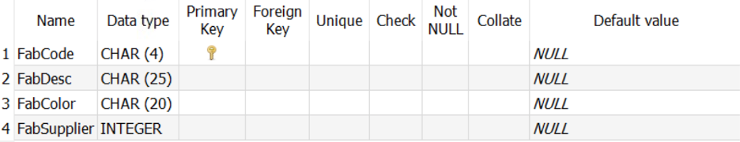
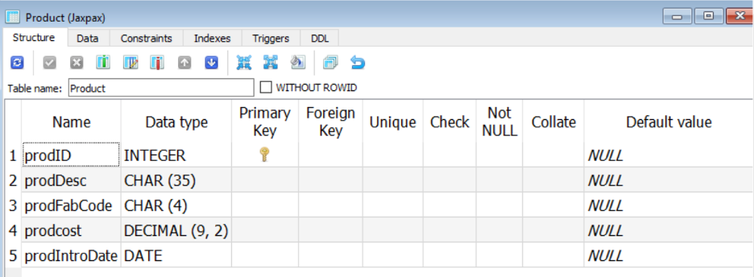
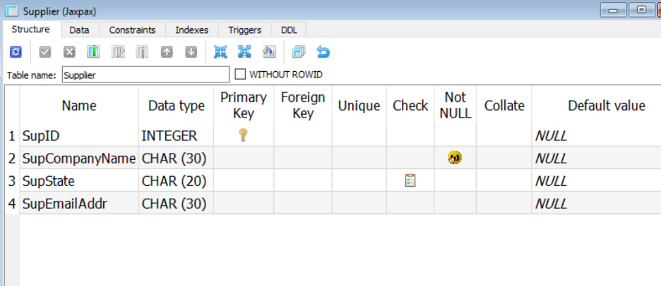
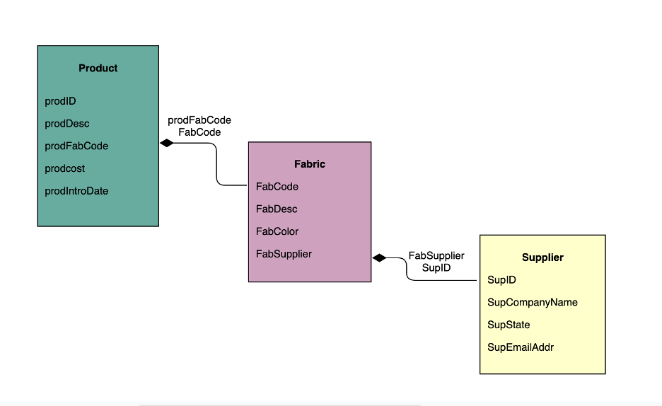
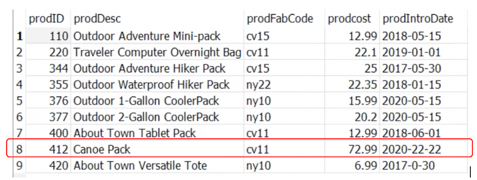
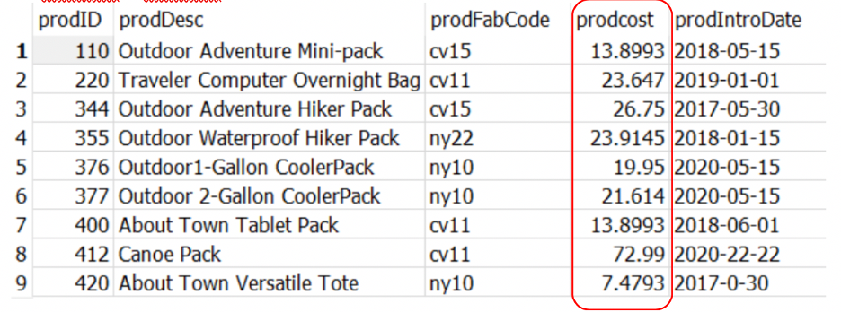
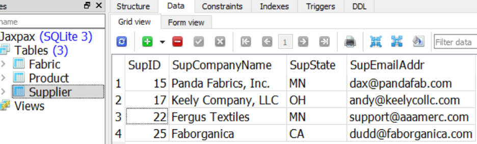
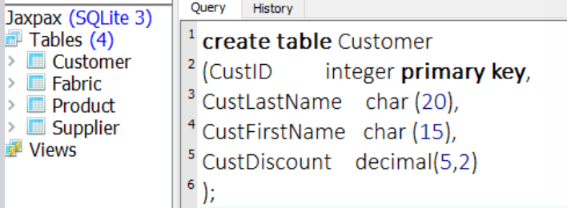
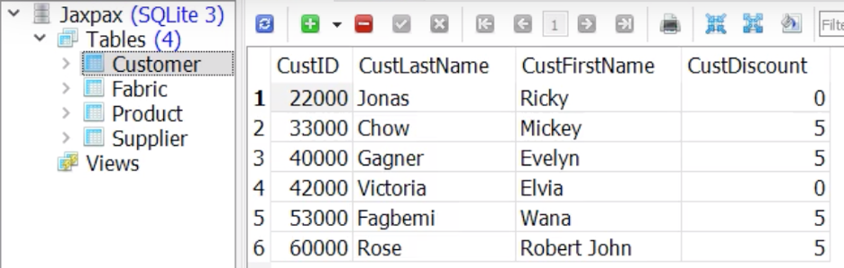

### SQL-DATA-MANIPULATION
#### Part 1:
1)Identify data types and constraints which affect the way of data manipulation

2)INSERT command and UPDATE command: insert rows of new data into a relational database table and modify existing pieces of data within a table row

3)Troubleshooting: locate and repair syntax errors in SQL code.

4)Developed and run a script that laods a relational table with multiple rows at a time; eliminated data from existing tables

#### 1. To identify data types and constraints that affect the way you manipulate table data.
There are 4 fields in the table Fabric, 5 fields in the table Product, 4 fields in the table Supplier.
Click the structure to look at the data type and maximum size of each field

#### relational schema

#### 2. INSERT command
***** insert new rows to the table

	Insert into Product
	Values
	(377, ‘Outdoor 2-Gallon CoolerPack’,’ny10’,20.20,’2020-05-15’)

	Insert into Product
	Values
	(376, ‘Outdoor 1-Gallon CoolerPack’,’ny10’,15.99,’2020-05-15’)

### 3. Trouble Shooting

	Insert into Product
	Values
	(400, ‘Canoe Pack’, cv11, $72.99, 2020-22-22’)

Error 1: $72.99, fixed: no dollar sign

Error 2: Error while executing SQL query on database ‘Jaxpax’: unrecognized token: “)”
         fixed: It should be ‘2020-22-22’
	    
Error 3: Error while executing SQL query on database ‘Jaxpax’: no such table Products
	 fixed: Table name is Product not Products
	 
Error 4: Error While executing SQL query on Database ‘Jaxpax’: no such column: cv 11
	 fixed: cv11 is a character name, it should have a quote around, ’ cv11’
	 
Error 5: Error While executing SQL query on Database ‘Jaxpax’: UNIQUE constraint failed: Product.prodID
	fixed: Double check if the product id number 400 already exist
	(412, ‘Canoe Pack’, ‘cv11’, 72.99, ‘2020-22-22’)
  
  
 Notez: Now I have a new product, product id 412, but I noticed that my product out of the date, there is no month 22.
 
### 4. UPDATE command
Use update command changes the DATA inside of an existing table, but not the table’s structure
Scenario:
Shipping prices have risen across the board, driving the overall production costs up about 7%.
I have go to the table Product, review the current product cost and increase all of them by 7% 

	update Product
	set prodcost = (prodcost*1.07)

 
Note:
The calculated values now have more than two decimal places. Numbers are stored that way 
and rounded when they’re retrieved

Scenario:
AAA Mercantile has been purchased by a competitor. The company’s name is now Fergus Textiles.

	update Supplier
	set supcompanyname = ‘Fergus Textiles’
	Where supID = 22

#### 5 The Batch load
create new table named Customer

	Create table Customer
	(CustID		 integer primary key,
	CustLastName		char(20),
	CustFirstName		char(15),
	CustDiscount		decimal(5,2)
	);

	Insert into Customer
	Values
	(22000, ‘Jonas’, ‘Ricky’, 0),
	(33000, ‘Chow’, ‘Mickey’, 5),
	(42000, ‘Victoria’, ‘Elvia’, 0)
	(53000, ‘Fagbemi’, ‘Wana’, 5),
	(60000, ‘Rose’, ‘Robert John’, 5)
	;

Note: you can type this customer information in the notepad and saved it as “loadCustomer.sql” and then load the .sql file to the query window

#### 6 DELETE and DROP

	delete from Customer
	Where CustID = 22000

Note: WHERE Clause is very important, DELETE Customer without WHERE all rows of data from the table will be deleted, and the table structure intact

	delete from Customer
	Where  CustDiscount = 5

	Drop table Customer

 

